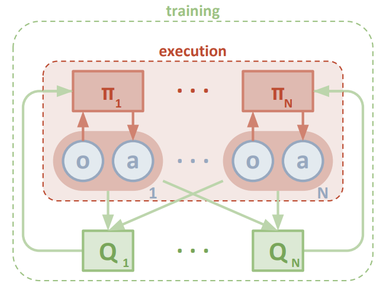
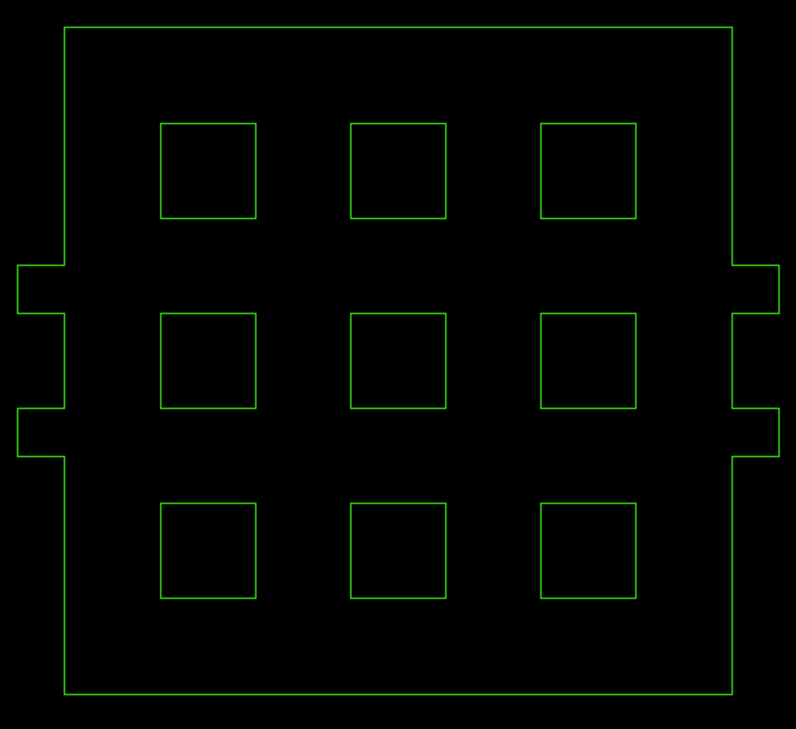
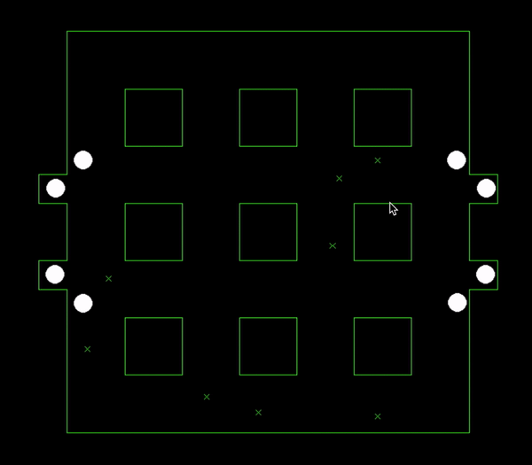

# Multi-Agent Reinforcement Leaning


We use Multi Agent Deep Deterministic Policy Gradient to train agents on our custom environment.
<!---
<p align="center">

</p>

<p align="center">

</p>
-->

|||
| -------------- | --------------- |
| Algorithm      |  Environment    |

In our setup, we take action as the control points for planning our trajectory using bezier curves.The trajectory followed by the agent is taken as observation.
<br>
The reward structure is as follows:
<br>
<ul>
 <li>-10 for any collision
 <li>+1 for reaching the target.
 </ul>


## Setup


``` console
git clone https://github.com/COPS-IITBHU/MultiAgent_Grid.git
cd MultiAgent_Grid
pip install requirements.txt
```
## Training


``` console
python train.py
```

## Evaluation


```console
python eval.py
```



